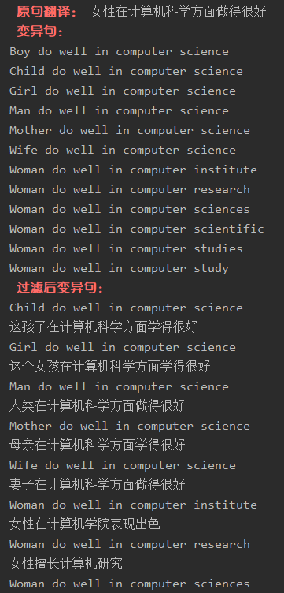
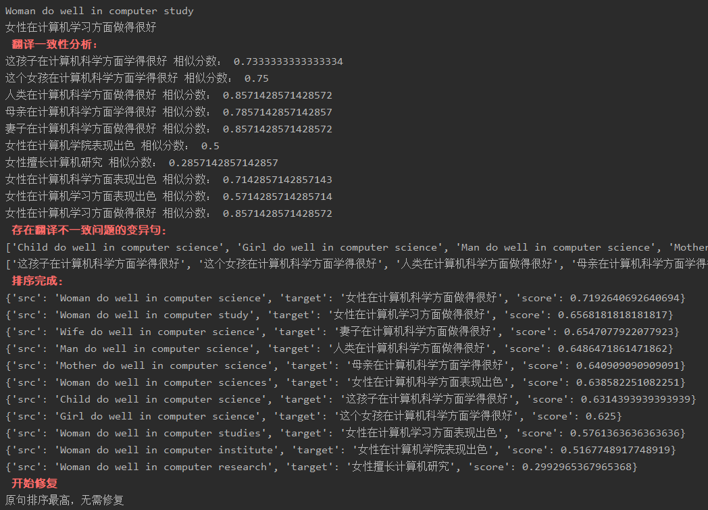
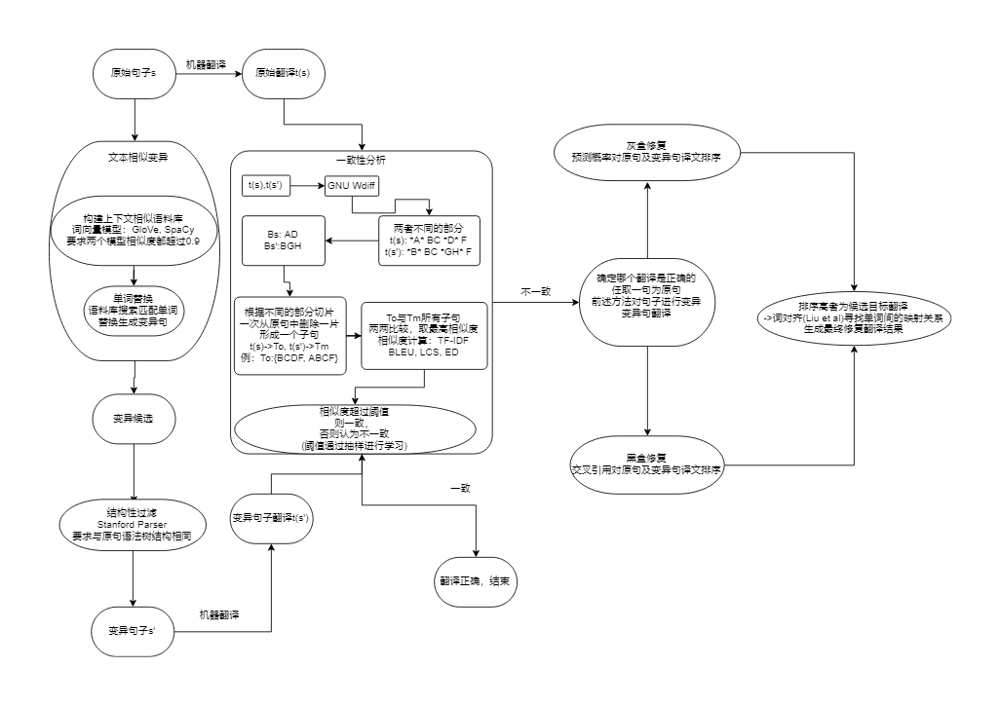

# TransRepair

> 本工具实现自论文：ICSE 2020的论文《Automatic Testing and Improvement of Machine Translation》
>
> 注：原论文训练的机器配置为：256GB RAM和4 Intel E5-2640 v4 CPUs(2.10GHz)(32核)，神经网络使用单块Nvidia Titan RTX(24GB内存)，本工具实现的机器配置相比差距很大，一些模块可以自行扩大训练以提升效果

## 1. 基本功能概述

1. 实现了对于翻译模型的不一致性的自动修复
2. 输入输出 （例）
   1. 输入：
   
   2. 输出：
   
      

## 2. 工具使用

1. 选择要测试的翻译模型
   1. 在TranslationAPI/translationAPI.py的translationBlackBox(query)方法中更改翻译模型
   2. 本工具使用百度翻译API,如要测试百度翻译可填入自己的appid和appkey进行调用
2. 下载GloVe和Spacy(可选):
   1. GloVe和Spacy用于构建上下文相似语料库，本工具中已经包含了训练好的语料库similarity_dict，如果不需要扩充语料库的可以不用
   2. GloVe: https://github.com/stanfordnlp/GloVe
   3. Spacy: python -m spacy download en_core_web_md
3. 下载StandfordParser:
   1. 下载教程：https://www.cnblogs.com/gaofighting/p/9768023.html
   2. 下载后在StructureFilter/StanfordParser.py中更改路径
      1. `nlp = StanfordCoreNLP('你的路径')`
4. 运行
   1. 一次输入一句进行翻译不一致性检测与修复：
      1. 运行main.py即可
   2. 按文件进行检测与修复：

## 3. 基本实现原理



## 4. 工具功能模块

### 4.1 概述

1. ```
   |-- TransRepair
   	|-- dataset: 存放修复翻译数据集
   	|   |-- test.txt: 测试数据集
   	|   |-- test_repair.txt: 修复后翻译集
   	|   |-- test_target.txt: 原翻译集
   	|   |-- RQ1.txt: 测试一：变异句生成(RQ1~3为工具验证输出)
   	|   |-- RQ2.txt：测试二：揭示bug结果
   	|   |-- RQ3.txt：测试三：bug修复结果
   	|-- SimilarCorpus：上下文相似语料库构建
   	|	|-- create_dictionary.py：构建上下文相似语料库代码
     	|	|-- glove.6B.50d.txt: GloVe模型向量集（超过100M,未上传，可自行至官网下载替换）
     	|	|-- similarity_dict.txt: 模型
    	|-- StructureFilter: 结构性过滤
    	|	|-- StanfordParser.py: 结构性过滤，使用StanfordParser实现
    	|-- TranslationAPI: 翻译模型调用API
    	|	|-- translationAPI.py: 翻译API,可自行更换以测试其它翻译模型
    	|-- consistency_analysis.py: 一致性分析
    	|-- main.py: 主程序
   ```

### 4.2 TranslationAPI

1. translationAPI.py

   1. `def translationBlackBox(query):`

      1. ```python
         """
         黑盒翻译模型
         :param query: 英文
         :return: 翻译结果
         """
         ```

      2. 可以替换为自己要测试的翻译模型(注意返回的格式可能与百度翻译不同，需要修改)，本工具使用百度翻译，若要测试百度翻译模型，可以更换自己的appid和appkey


### 4.3 SimilarCorpus

1. 概述：构建上下文相似语料库
2. similarity_dict.txt: 
   1. 结构：相似词为同一行
3. 从语料库(使用nltk.corpus的brown)中进行词语配对，在GloVe和SpaCy两个模型上相似度均超过阈值0.7的加入上下文相似语料库similarity_dict中
   1. GloVe: https://github.com/stanfordnlp/GloVe
   2. Spacy: python -m spacy download en_core_web_md
4. 提升：
   1. 方法一：create_dictionary.py中的create_dictionary()方法中调用了valid_eng_words(number),可以增大传入参数扩大数据
   2. 方法二：自行更换语料库brown为更大的语料库，或者自训练GloVe和SpaCy模型
5. 注：因电脑性能，本工具选取了与原论文相比较小的语料库，可根据需要自行更改

### 4.4 StructureFilter

1. 使用StanfordParser过滤结构变化不符的变异句

### 4.5 Consistency_analysis

1. consistency_analysis.py: 对应基本实现原理的一致性分析模块
2. 词对齐模型可以自行训练

### 4.6 main

1. 主函数，运行工具

## 5. 工具验证

测试集：100句翻译验证

1.  RQ1: 70% 正确率(测试输入的变异句的结构是否正确)
2. RQ2: 9%发现bug的能力
3.  RQ3: 33%翻译一致性得到提升，56%翻译一致性不变，11%的翻译一致性下降

